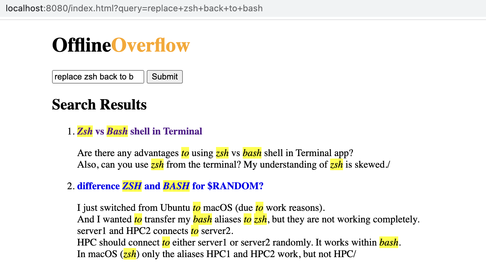
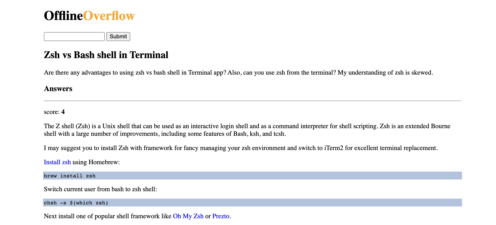

# OfflineOverflow

Set of scripts and presets to build your own subset copy of StackOverflow for offline usage

## How it works

We are going to download public StackOverflow databaset

Import wanted data into ElasticSearch

Build our own container with UI

## StackOverflow Dataset

Public StackOverflow dataset can be found here: https://archive.org/download/stackexchange/Stackoverflow.com-Posts.7z

Other datasets available here: https://archive.org/download/stackexchange

Take a note that file size is almost 20gb so it may take from few hours to infinity to download it, taking that into consideration recomdation is to also download some smaller datasets (in my experimentations I was playing with "apple.stackexchange.com.7z" which is only 250mb in size)

So in my case it was:

```bash
# download small dataset for experiments
wget https://archive.org/download/stackexchange/apple.stackexchange.com.7z

# download full dataset
wget https://archive.org/download/stackexchange/Stackoverflow.com-Posts.7z
```

To check validity of archive you may use:

```bash
7z t apple.stackexchange.com.7z
```

Note: Archive may consist of multiple files for small datasets and single files for big datasets but in either case we are looking for "Posts.xml" so if you decide to import comments as well you gonna need to download another archive

If `7z` is not available it might be installed like so `brew install p7zip` and for linux `apt install -y p7zip-full`

## Import

There is quadrillion ways to do it, I going to do it with C#, there is many examples of how it may be done like [here](https:///github.com/russcam/stack-overflow) also there is library to read contents of 7z archive

The program itself expects ElasticSearch to be up and running, so:

```bash
rm -rf data || true
mkdir data

docker run -d --name=elastic -e discovery.type=single-node -e xpack.security.enabled=true -e ELASTIC_PASSWORD=S3cr3tPAssw0rd -p 9200:9200 -v ${PWD}/data:/usr/share/elasticsearch/data docker.elastic.co/elasticsearch/elasticsearch:8.5.0
```

Wait approx 20 seconds for ElasticSearch to start, verify it is running:

```bash
curl -u elastic:S3cr3tPAssw0rd http://localhost:9200/
```

Edit `Program.cs` and modify:

- `path` - to correct path to archive
- `tags` - wanted tags (we do not want to import everything because it will take way too much space and time)

And run import:

```bash
dotnet run
```

In my experiment with small dataset it took approx one minute to import 25K documents, but for big dataset it will take approx 2-3 hours

```log
done indexing 5320662 questions with 0 errors in 01:12:45
```

After import is done, we may want to check what data we have:

```bash
curl -u elastic:S3cr3tPAssw0rd 'http://localhost:9200/_cat/indices?v&h=health,index,docs.count,store.size'

curl -s -u elastic:S3cr3tPAssw0rd -X POST 'http://localhost:9200/_count' -H 'Content-Type: application/json' -d '{"query":{"term":{"postTypeId":{"value":1}}}}' | jq -r ".count"

curl -s -u elastic:S3cr3tPAssw0rd -X POST 'http://localhost:9200/_count' -H 'Content-Type: application/json' -d '{"query":{"term":{"postTypeId":{"value":2}}}}' | jq -r ".count"
```

And stop and remove container

```bash
docker stop elastic
docker rm elastic
```

From now on we may just start Elastic with imported dataset:

```bash
docker run -d --name=elastic -e discovery.type=single-node -e xpack.security.enabled=true -e ELASTIC_PASSWORD=S3cr3tPAssw0rd -p 9200:9200 -v ${PWD}/data:/usr/share/elasticsearch/data docker.elastic.co/elasticsearch/elasticsearch:8.5.0
```

## UI

Initial idea was to have ready to use single image with everything packed up inside

And to avoid seven rounds of hell with installing everything into elastic container I decided to put inside small binary without dependencies build with Go so it will just serve an UI and proxy requests to Elastic

To run it locally just run:

```bash
go run main.go
```

And open [localhost:8080](http://localhost:8080)





## Docker Image

To build an image we are going to build UI firs:

```bash
GOOS=linux GOARCH=amd64 go build main.go
```

```bash
docker build -t offlineoverflow .
```

Now we can run it alone:

```bash
docker run -it --rm -p 9200:9200 -p 8080:8080 --name=elastic offlineoverflow
```

And we are done, optionally image may be pushed somewhere

Depdending of desired tags image size vary in my case data folder is 8gb


## Tags

To get desired tags I am reading Google Chrome history so see what StackOverflow URL I have visited and for each of them trying to download page and parse its tags

```bash
pwsh tags.ps1
```

Notes:

- we are copying database to avoid "database is locked error", if Chrome is closed we may query it directrly
- StackOverflow has some rate limits so be carefull
- History is not forewer but from what I see is good enough
- Also majority of questions has overlapping tags so in my first attempt I was sure something like `c#`, `go` and `node.js` will be enough

## Fun fact

In the middle of experiments once again I was offline

But thankfully with already imported data

And I were using it to figure out how to develop UI while being offline :)

So it was already usefull


## Alternative approach

StackOverflow data is published to BigQuery so we may do something like:

```bash
# export query to myprojectid:mydataset.stackoverflow
bq --format=prettyjson query --use_legacy_sql=false --destination_table myprojectid:mydataset.stackoverflow "WITH CTE AS ( SELECT id FROM bigquery-public-data.stackoverflow.stackoverflow_posts WHERE contains_substr(tags, 'c#') or contains_substr(tags, 'go') or contains_substr(tags, 'node.js') ) SELECT * FROM bigquery-public-data.stackoverflow.stackoverflow_posts where id in (select id from CTE) or parent_id in (select id from CTE)"

# export myprojectid:mydataset.stackoverflow to gs://mystorage/stack.*
bq extract --destination_format NEWLINE_DELIMITED_JSON 'myprojectid:mydataset.stackoverflow' 'gs://mystorage/stack.*'

# download gs://mystorage/stack.* to ~/Downloads/stack/stack.*
mkdir ~/Downloads/stack/ || true
gsutil -m cp "gs://mystorage/stack.*" ~/Downloads/stack/

# cleanup gs://mystorage
gsutil -m rm -r "gs://mystorage/stack.*"

# remove table
bq rm -f -t myprojectid:mydataset.stackoverflow
```

Which will download bunch of new line delimied json data files

The benefit here is that files are much smaller and we downloaded only wanted data

After that we need to swite some script or program to import this data into ElasticSearch and technically next steps will be the same

Also I had an idea instead of having ElasticSearch just to grep lines over files but it does take way to long time, aka:

```bash
time grep -r "json.Marshal" . | wc -l
# 620
# real	0m32.015s

time grep -r '"parent_id":"6156501"' . | wc -l
# 19
# real	0m50.298s
```

## Ideas

Archive file contains all the data

What if we will write some programm to create and index of top of it

The idea here is that we are going to open archive and read its posts

For each post perform tokenization and take trigrams for example

And store offsets for each trigram in index

We may use this index for search by tokenizing query and looking at index for its trigrams and reading desired bytes from archive, process them and returning response

Theoretically it might be a simple database over archive file

